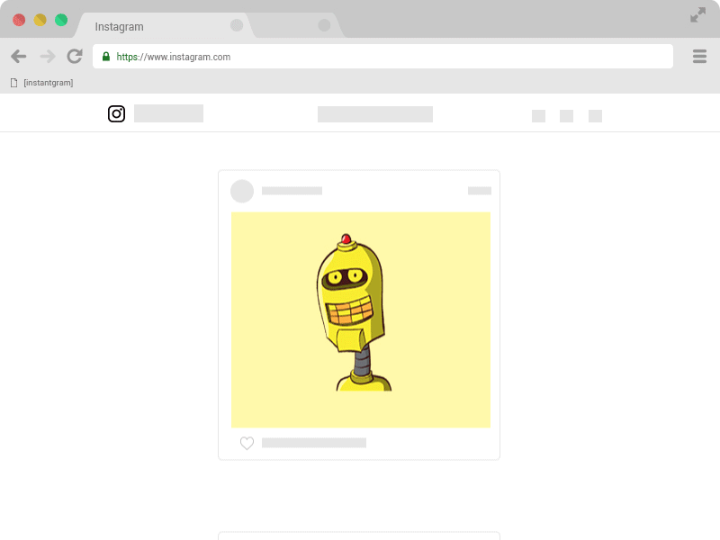

#  [instantgram] v2026.07.25

[Portuguese version](https://saschaheim.github.io/instantgram/lang/pt-br/?force=true)

[instantgram] is a bookmarklet for downloading Instagram media. It is tiny, simple, and does not require extensions or extra downloads. Open [this link][1], drag the [instantgram] button to your browser's bookmarks bar, navigate to instagram.com, open an Instagram post, and click the bookmarklet. That's it.

### [:arrow_right: Bookmarklet][1]

:bulb: instantgram has been completely rewritten. \
This version supports all modern browsers with ECMAScript 2015 (ES6) support.

## Compatibility

| Browser | Compatible? |
| ------- | ----------- |
| Google Chrome | :white_check_mark: |
| Mozilla Firefox | :white_check_mark: |
| Edge on Chromium >= 80 | :white_check_mark: |
| Edge Legacy* | :warning: |
| Internet Explorer 11 | :x: |

*_ Apparently Edge Legacy does not allow dragging a button to the bookmarks bar.

## Roadmap

- Ongoing maintenance, bug fixes, and Instagram compatibility updates.

## Contributing

Read [CONTRIBUTING.md](CONTRIBUTING.md) for more information. :heart:

## Changelog

- Full history: [CHANGELOG.md](CHANGELOG.md)

- v2026.07.25 - [instantgram] Further follow-up to issue #45. Instagram's web_profile_info endpoint -- the root cause of the account-specific empty story/profile bug -- is now switched off entirely instead of being attempted and fallen back from: story and profile-picture lookups go straight to a feed-based fallback (falling back further to search if needed). Profile pictures for business/creator accounts where Instagram's user-info endpoint now returns no picture data at all (confirmed with a real captured response) fall back to the picture already present in that feed lookup instead of failing with "Incomplete userDetails received". Added GitHub issue templates that require console/network output up front, so bug reports come with enough information to act on without a back-and-forth. Also added a standalone, dev-only tool for fetching real Instagram API responses used to build the test suite's fixtures, including login and 2FA support and session caching.
- v2026.07.24 - [instantgram] Follow-up to issue #45: fixed all four localized bookmarklets exceeding Firefox's 65536-byte bookmark limit (introduced by the previous release's fixes), by removing duplicated code across the scanner modules instead of cutting functionality -- a shared video mute-state helper, a shared date-formatting helper, a shared "No target found." constant, a shared scanner catch-block error handler, and a shared proxy-download-URL builder. All locales now have 800+ bytes of headroom again. Also migrated @metalsmith/layouts to v3 (verified byte-identical page output) and bumped @types/node to v26, fixed the remaining npm audit vulnerabilities via dependency overrides, and fixed a pre-existing MediaType.ts casing warning.
- v2026.07.23 - [instantgram] Fixed issue #45 [Many stories now fail to be captured]: stories rendered as an empty, buttonless slider whenever Instagram's reels_media response came back with zero items instead of showing a clear "not found" message. Root-caused this (with a real, confirmed example) to some accounts currently breaking Instagram's web_profile_info endpoint with a server-side schema error; story and profile-picture lookups now fall back to Instagram's search endpoint to resolve the same account id, so those stories and profile pictures load normally again instead of just failing gracefully. Also fixed a related bug where a failed story-owner lookup was misread as "this is a highlight", triggering a second, malformed request. The "not found" message shown for genuine API failures no longer incorrectly asks "did you open a post?" when a valid story/post/profile *was* found -- it now shows an honest, distinct message instead. Added a Vitest test suite covering posts, reels, stories and profiles, built from realistic and, where captured live, verbatim real Instagram API response fixtures, so future Instagram API shape changes surface as a specific failing test instead of a silent empty modal. Normalized repository line endings to CRLF via .gitattributes.

[1]: https://saschaheim.github.io/instantgram
